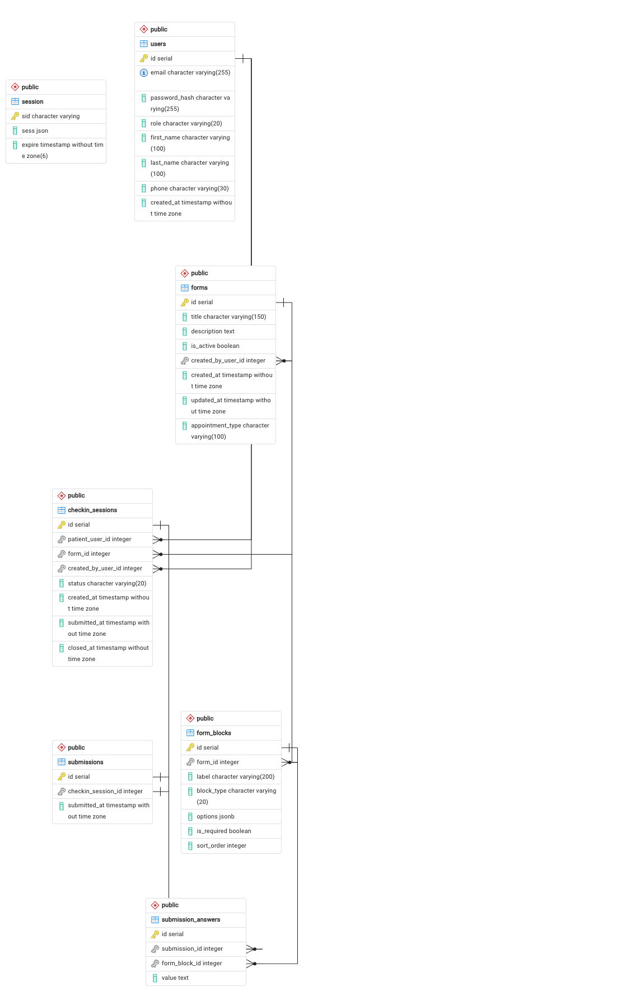

# MedTap

## Project Description

MedTap is a patient intake and check-in platform for a medical practice. Front-desk staff create digital intake forms (new patient, follow-up, etc.), assign a form to a patient when they arrive for an appointment, and watch a live status queue as the patient fills it out. Patients log in, complete the form assigned to them, and can view the status and history of all their past check-ins.

It's built for two audiences: a practice's front-desk/owner staff who need a simple way to manage intake forms and see who's checked in, and patients who need a fast way to fill out paperwork before an appointment instead of a clipboard.

**Tech stack:** Node.js, Express, EJS, PostgreSQL, `express-session` (session-based auth, no JWT), bcrypt, `express-validator`. ESM throughout, MVC folder structure, deployed on Render with a Render-managed PostgreSQL database.

## Database Schema

Six related tables: `users` (single table for all three roles), `forms`, `form_blocks` (the fields on a form), `checkin_sessions` (a form assigned to a patient), `submissions`, and `submission_answers`.



<details>
<summary>Entity relationships (text form)</summary>

```
users (id, email, password_hash, role, first_name, last_name, phone, created_at)
forms (id, title, description, appointment_type, is_active, created_by_user_id -> users.id, created_at, updated_at)
form_blocks (id, form_id -> forms.id, label, block_type, options, is_required, sort_order)
checkin_sessions (id, patient_user_id -> users.id, form_id -> forms.id, created_by_user_id -> users.id, status, created_at, submitted_at, closed_at)
submissions (id, checkin_session_id -> checkin_sessions.id [unique], submitted_at)
submission_answers (id, submission_id -> submissions.id, form_block_id -> form_blocks.id, value)
```

</details>

## User Roles

| Role | Description | Permissions |
|---|---|---|
| **Owner** | Practice admin/full control | Everything staff can do, plus: create/edit/delete/deactivate intake forms, create and remove staff accounts |
| **Staff** | Front-desk employee | View the live check-in queue, create check-in sessions for patients, view submitted answers |
| **Patient** | Standard user | Complete forms assigned to them, save progress and finish later, cancel a check-in before submitting, view their own check-in history |

## Test Account Credentials

Password for all test accounts: `P@$$w0rd!`

| Role | Email |
|---|---|
| Owner | `owner@medtap.test` |
| Staff | `staff@medtap.test` |
| Patient | `patient@medtap.test` |

## Running Locally

```bash
pnpm install
cp .env.example .env   # fill in DB_URL and SESSION_SECRET
pnpm dev
```